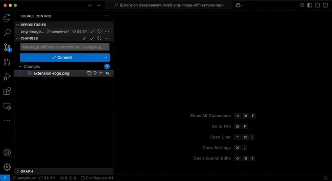

# Image diff viewer

Replaces the built in image viewer for jpeg and png images.

## Features

- Scroll to zoom
- Click & drag pan
- Sync panning when viewing diff
- Highlight differences with mask from [pixelmatch](https://github.com/mapbox/pixelmatch)!

## Commands

- **Toggle diff mask** - Should toggle the diff mask in the active diff view.
- **Toggle swipe mode** - Should toggle between a stacked swipe viewing mode.
- **Diff last opened images** - Will force link last two opened webviews.
  If vscode opens a diff and your images aren't linked with diff and sync then
  this is the workaround.

> Note that the extension API doesn't allow to directly get the active webview so
> detection is based on visibility state changes. Therefore toggle commands might
> be sketchy.

## Extension Settings

- `image-diff.viewer.minScaleOne` - Will always have 1 or less as the minimum scale
- `image-diff.viewer.imageRendering` - Sets the `image-rendering` css property on the image
- `image-diff.diff.defaultAlign` - Sets the default diff alignment for images with different dimensions.

## Known Issues

- The swipe mode suffers from transform and scaling limits that don't allow for
the images to pan naturally and isn't correct for the view

> This extension is in very early days. And it's subject to change anytime.

## Release Notes

Not 'released' yet. Check changelog for changes.

## Contribution

This extension was started from the
[VS Code Extension Generator](https://www.npmjs.com/package/generator-code)
And it's set up to be started the same as the basic extension outlined in the
[getting started guide for vscode](https://code.visualstudio.com/api/get-started/your-first-extension)
